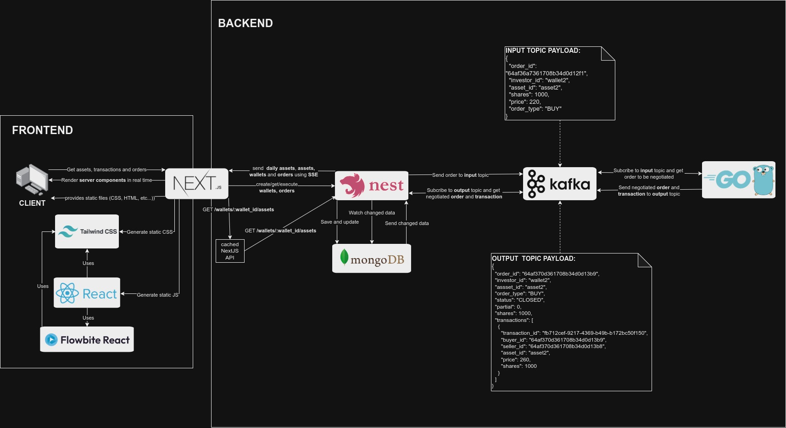

# Home Broker

Home broker is an online platform where people can buy and sell different assets, such as stocks and cryptocurrencies. This application allows you to invest your money in companies or assets you believe will grow in value over time. Through a home broker, you can manage your investments and make financial decisions with ease and convenience.

# Table of Contents

- [📝 Requirements](#-requirements)
- [💡 Features](#-features)
- [📦 Docs](#-docs)
  - [Architecture](#architecture)
  - [NextJS Frontend](#nextjs-frontend)
  - [NestJS Microservice](#nestjs-microservice)
  - [GO Trade Service](#go-trade-service)
- [🚀 How to Run?](#-how-to-run)
  - [First Option](#first-option)
- [🔄 How to use this?](#-how-to-use-this)
- [⚙️ Made With](#️-made-with)
- [🧑🏻‍💻 Author](#️-author)

## 📝 Requirements

- [Docker](https://www.docker.com/get-started/)
- [REST Extension in VSCode](https://marketplace.visualstudio.com/items?itemName=humao.rest-client)(optional)

## 💡 Features

In this home broker you'll be able to:

- Manage **Assets**, **Wallets** and **Orders** in a home broker by buying and selling assets;
- Track **orders** being bought and sold using a friendly interface with charts updated in real time (using Server Sent Events);
- Listen to negotiated trades sent via Kafka by [GO Service](/go-microservice/README.md);
- Get data using Server Sent Events (SSE) in order to get real time changes regarding daily changes in **Assets**, **Orders** or **Wallets**;
- Listen to changes in MongoDB and send it to client using SSE, the SSE endpoint send a payload to the client in the subscribed endpoint.


## 📦 Docs

### Architecture



### NextJS Frontend

Here is the frontend application, it lists the assets in a wallet and you're able to sell or buy assets here. Additionally, a chart with transactions in real time is shown here.

**More details here**: [Home Broker: NextJS Frontend](/nextjs-front/)

### NestJS Microservice

Like every sort of home brokers, you'll need to store and manage your assets, wallets and orders, and here it is! Inside this microservice is possible to manage the home broker, you may also subscribe to SSE routes, listen to events in MongoDB collections and send and receive messages via Kafka Topis.

**More details here**: [Home Broker: NestJS Microservice](/nestjs-microservice/)

### GO Trade Service

This GO project has as objective to make a trade when an asset is bought or sold in a home broker. With the negotiation finished after receiving an order via Kafka, a transaction is sent to Kafka topic in order to finish the trade in another microservice (in this case, the [Home Broker: NestJS Microservice](/nestjs-microservice/)).

GO was choosen to do the trade because of its parallelism features, like Go routines and channels.

**More details here**: [Home Broker: GO Trade Service](/go-microservice/)

## 🚀 How to Run?

If you want to run this project entirely, including microservices, database (MongoDB), Kafka and frontend (NextJS application), you must follow the steps below, in order to run each project individually:

### First Option:

1. Run Go Microservice:

```bash
cd go-microservice
docker-compose up
```

2. Run NestJS Microservice:

```bash
cd nestjs-microservice
docker-compose up
```

3. Run NextJS Frontend:

```bash
cd nextjs-front
docker-compose up
```

Congrats! You're now able to negotiate your assets in a home broker ;)

## 🔄 How to use this?

Simply access [http://localhost:3001/wallet1](http://localhost:3001/wallet1) and have fun ;)

In case you need to use the NestJS API or Go Microservice, access theirs README to learn more.

## ⚙️ Made With:

- Go Lang 1.20.3
- Zookeeper 7.3.0
- Kafka 7.3.0
- Control Center 7.3.0
- NestJS 10.0.0
- Prisma 4.16.1
- MongoDB 5.0.17
- NodeJS 20.0.0
- Typescript 5.1.3
- NextJS 13.4.7
- ReactJS 18.2.0
- Tailwind 3.3.2
- Flowbite React 0.4.9
- Typescript 5.1.3
- Docker 20.10.7

## 🧑🏻‍💻 Author

_Matheus Oliveira da Silva_ - [Github](https://github.com/matheusolivesilva) | [Linkedin](https://www.linkedin.com/in/matheusoliveirasilva/)
