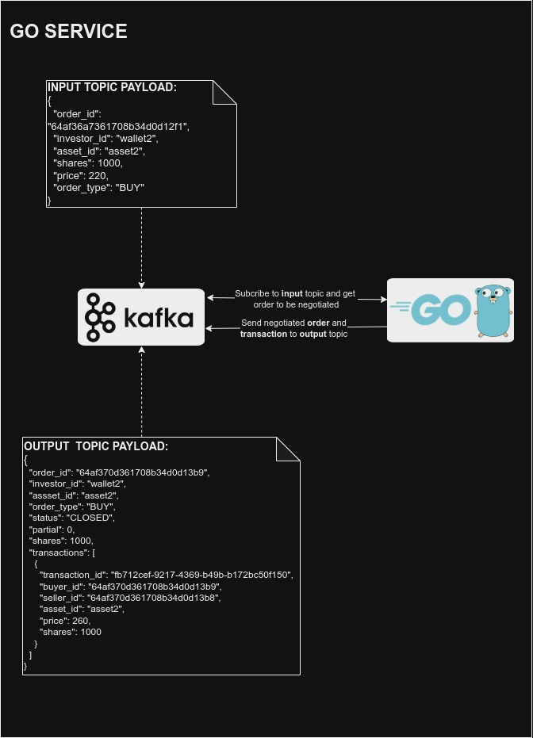

# Home Broker: GO Trade Service

This GO project has as objective to make a trade when an asset is bought or sold in a home broker.

## Table of Contents

- [Requirements](#requirements)
- [Docs](#docs)
- [Features](#features)
  - [Architecture](#architecture)
  - [Kafka Topics](#kafka-topics)
    - [Trade and negotiation](#trade-and-negotiation)
    - [Negotiated order](#negotiated-order)
- [How to Run?](#how-to-run)
- [How to Test?](#how-to-test)
- [How to use this?](#how-to-use-this)
- [Made With](#made-with)
- [Author](#author)

## 📝 Requirements

- [Docker](https://www.docker.com/get-started/)

## 💡 Features

You can make a home broker negotiation through a Kafka topic in order to buy our sell assets, see more at [Docs section](#docs) .

## 📦 Docs

### Architecture



### Kafka Topics

You can make a negotiation in home broker through a Kafka topic in order to buy our sell assets. You'll see below the topics that this service is subscribed or send messages to.

#### Trade and negotiation

<code>**Subscribe to topic:** input</code>

<code>**Action:** Create a book and make a trade with the received order (negotiation)</code>

<code>BODY FROM TOPIC:</code>

```json
{
  "order_id": "64af36a7361708b34d0d12f1",
  "investor_id": "wallet2",
  "asset_id": "asset2",
  "shares": 1000,
  "price": 220,
  "order_type": "BUY"
}
```

#### Negotiated order

<code>**Send to topic:** output</code>

<code>**Action:** Send negotiated order</code>

<code>BODY TO TOPIC:</code>

```json
{
  "order_id": "64af370d361708b34d0d13b9",
  "investor_id": "wallet2",
  "assset_id": "asset2",
  "order_type": "BUY",
  "status": "CLOSED",
  "partial": 0,
  "shares": 1000,
  "transactions": [
    {
      "transaction_id": "fb712cef-9217-4369-b49b-b172bc50f150",
      "buyer_id": "64af370d361708b34d0d13b9",
      "seller_id": "64af370d361708b34d0d13b8",
      "asset_id": "asset2",
      "price": 260,
      "shares": 1000
    }
  ]
}
```

## 🚀 How to Run?

You can run by simply using the following comand:

```bash
docker-compose up
```

Congrats! You're now able to negotiate your assets in a home broker ;)

## ✅ How to Test?

```bash
go test ./...
```

## 🔄 How to use this?

1. Access Kafka **Control Center** in [http://localhost:9021](http://localhost:9021), open your Cluster e go to **Topics**;
2. Open the topic called **input**, if it doesn't exist, create a new one;
3. You should send to Kafka in **input** topic [this json body to buy an asset](kafka-payload-buy.json) OR [this json body to sell an asset](kafka-payload-buy.json);
4. Go to **topics** and you should see a new topic called **output** with the processed trade;
5. DONE! Now you may subscribe your software, API or service to **output** topic to listen for trades and/or send orders to **input** topic to make a trade.

## ⚙️ Made With:

- Go Lang 1.20.3
- Zookeeper 7.3.0
- Kafka 7.3.0
- Control Center 7.3.0
- Docker 20.10.7

## 🧑🏻‍💻 Author

_Matheus Oliveira da Silva_ - [Github](https://github.com/matheusolivesilva) | [Linkedin](https://www.linkedin.com/in/matheusoliveirasilva/)
