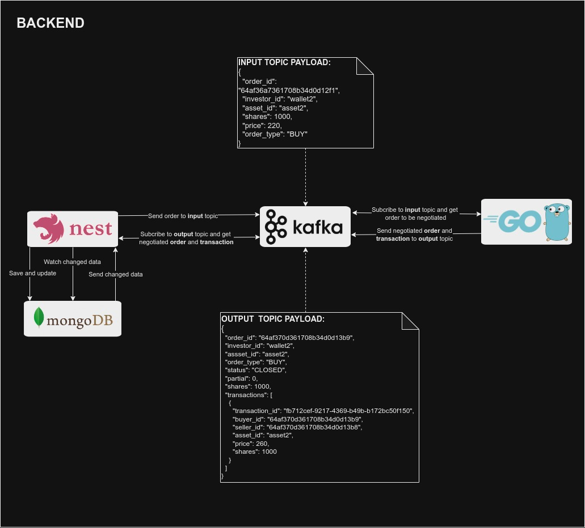

# Home Broker: NestJS Microservice

This API works as an intermediate between client, Kafka and another Go Microservice. Inside this API you'll have persisting and part of the business logic regarding a home broker.

## 📖 Table of Contents

- [Requirements](#-requirements)
- [Features](#-features)
- [Docs: Architecture, endpoints, Kafka topics and more](#docs-architecture-endpoints-kafka-topics-and-more)
  - [Architecture](#architecture)
  - [REST Endpoints](#rest-endpoints)
    - [Create a financial asset to be negotiated](#create-a-financial-asset-to-be-negotiated)
    - [List all assets to be negotiated](#list-all-assets-to-be-negotiated)
    - [Create a wallet](#create-a-wallet)
    - [List all wallets](#list-all-wallets)
    - [Add asset to wallet](#add-asset-to-wallet)
    - [List wallets with its assets](#list-wallets-with-its-assets)
    - [Init order transaction](#init-order-transaction)
    - [List all order transactions](#list-all-order-transactions)
  - [SSE Routes](#sse-routes)
    - [Triggered when daily asset is created in MongoDB](#triggered-when-daily-asset-is-created-in-mongodb)
    - [Triggered when asset price is updated in MongoDB](#triggered-when-asset-price-is-updated-in-mongodb)
    - [Triggered when an order is updated or created in MongoDB](#triggered-when-an-order-is-updated-or-created-in-mongodb)
    - [Triggered when an asset belonging to a wallet is updated](#triggered-when-an-asset-belonging-to-a-wallet-is-updated)
  - [Kafka Topics](#kafka-topics)
    - [Execute transaction consumer](#execute-transaction-consumer)
    - [Init transaction](#init-transaction)
  - [MongoDB (Prisma Schema)](#mongodb-prisma-schema)
  - [MongoDB Events (with SSE)](#mongodb-events-with-sse)
- [How to Run?](#how-to-run)
- [How to use this?](#how-to-use-this)
- [Made With](#made-with)
- [Author](#author)

## 📝 Requirements

- [Docker](https://www.docker.com/get-started/)
- [REST Extension in VSCode](https://marketplace.visualstudio.com/items?itemName=humao.rest-client) (optional)

## 💡 Features

With this API you'll be able to:

- Manage **Assets**, **Wallets** and **Orders** in a home broker;
- Listen to negotiated trades sent via Kafka by [GO Service](../go-microservice/README.md);
- Get data using Server Sent Events (SSE) in order to get real time changes regarding daily changes in **Assets**, **Orders** or **Wallets**;
- Listen to changes in MongoDB and send it to client using SSE, the SSE endpoint send a payload to the client in the subscribed endpoint.

## 📦 Docs: Architecture, Endpoints, Kafka topics and more

This API has different types of resources and ways to communicate with client and another services (such as Kafka topics), beyond that, a MongoDB database is used to store home broker data.

### Architecture



### REST Endpoints

Base URL: http://localhost:3000

#### Create a financial asset to be negotiated

<code>POST</code> <code>/assets</code>

<code>REQUEST BODY:</code>

```json
{
  "id": "asset1",
  "symbol": "A1",
  "price": 100
}
```

<code>RESPONSE BODY:</code>

```json
{
  "id": "asset1",
  "symbol": "A1",
  "price": 100,
  "created_at": "2023-07-14T01:19:36.015Z",
  "updated_at": "2023-07-14T01:19:36.015Z"
}
```

#### List all assets to be negotiated

<code>GET</code> <code>/assets</code>

<code>RESPONSE BODY:</code>

```json
[
  {
    "id": "asset1",
    "symbol": "asset1",
    "price": 199,
    "created_at": "2023-07-12T23:26:13.224Z",
    "updated_at": "2023-07-12T23:29:32.951Z"
  }
]
```

#### Create a wallet

<code>POST</code> <code>/wallets</code>

<code>REQUEST BODY:</code>

```json
{
  "id": "wallet1"
}
```

<code>RESPONSE BODY:</code>

```json
{
  "id": "wallet3",
  "created_at": "2023-07-14T01:51:42.950Z",
  "updated_at": "2023-07-14T01:51:42.950Z"
}
```

#### List all wallets

<code>GET</code> <code>/wallets</code>

<code>RESPONSE BODY:</code>

```json
[
  {
    "id": "wallet1",
    "created_at": "2023-07-12T23:26:13.241Z",
    "updated_at": "2023-07-12T23:26:13.241Z"
  }
]
```

#### Add asset to wallet

<code>POST</code> <code>/wallets/:wallet_id/assets</code>

<code>REQUEST BODY:</code>

```json
{
  "asset_id": "asset1",
  "shares": 10
}
```

<code>RESPONSE BODY:</code>

```json
{
  "id": "64b0ab6ed743e0f15b94ba5a",
  "wallet_id": "wallet1",
  "asset_id": "asset1",
  "shares": 10,
  "version": 1,
  "created_at": "2023-07-14T01:57:02.199Z",
  "updated_at": "2023-07-14T01:57:02.199Z"
}
```

#### List wallets with its assets

<code>GET</code> <code>/wallets/:wallet_id/assets</code>

<code>RESPONSE BODY:</code>

```json
[
  {
    "id": "64af3695361708b34d0d12c6",
    "wallet_id": "wallet1",
    "asset_id": "asset1",
    "shares": -89000,
    "version": 100,
    "created_at": "2023-07-12T23:26:13.257Z",
    "updated_at": "2023-07-12T23:29:32.915Z",
    "Asset": {
      "id": "asset1",
      "symbol": "asset1",
      "price": 199
    }
  }
]
```

#### Init order transaction

<code>POST</code> <code>/wallets/:wallet_id/orders</code>

<code>REQUEST BODY:</code>

```json
{
  "asset_id": "asset1",
  "shares": 5,
  "price": 100,
  "type": "SELL"
}
```

<code>RESPONSE BODY:</code>

```json
{
  "id": "64b0ae2ed743e0f15b94ba5b",
  "wallet_id": "wallet1",
  "asset_id": "asset1",
  "shares": 5,
  "price": 100,
  "type": "SELL",
  "status": "PENDING",
  "partial": 5,
  "version": 1,
  "created_at": "2023-07-14T02:08:46.641Z",
  "updated_at": "2023-07-14T02:08:46.641Z"
}
```

#### List all order transactions

<code>GET</code> <code>/wallets/:wallet_id/orders</code>

<code>RESPONSE BODY:</code>

```json
[
  {
    "id": "64b0ae2ed743e0f15b94ba5b",
    "wallet_id": "wallet1",
    "asset_id": "asset1",
    "shares": 5,
    "price": 100,
    "type": "SELL",
    "status": "PENDING",
    "partial": 5,
    "version": 1,
    "created_at": "2023-07-14T02:08:46.641Z",
    "updated_at": "2023-07-14T02:08:46.641Z",
    "Transactions": [],
    "Asset": {
      "id": "asset1",
      "symbol": "asset1"
    }
  }
]
```

### SSE Routes

#### Triggered when daily asset is created in MongoDB

<code>GET<code>**|**</code>SSE</code> <code>/assets/:id/daily/events</code>

<code>RESPONSE BODY:</code>

```json
{
  "type": "asset-daily-created",
  "data": {
    "id": "64af369dd743e0f15b94b769",
    "asset_id": "asset2",
    "price": 205,
    "date": "2023-07-12T23:26:21.654Z",
    "created_at": "2023-07-12T23:26:21.656Z",
    "updated_at": "2023-07-12T23:26:21.656Z"
  }
}
```

#### Triggered when asset price is updated in MongoDB

<code>GET<code>**|**</code>SSE</code> <code>/assets/events</code>

<code>RESPONSE BODY:</code>

```json
{
  "type": "asset-price-changed",
  "data": {
    "id": "asset3",
    "symbol": "A1",
    "price": 100,
    "created_at": "2023-07-14T01:19:36.015Z",
    "updated_at": "2023-07-14T01:19:36.015Z"
  }
}
```

#### Triggered when an order is updated or created in MongoDB

<code>GET<code>**|**</code>SSE</code> <code>/wallets/:wallet_id/orders/events</code>

<code>RESPONSE BODY 1:</code>

```json
{
  "type": "order-created",
  "data": {
    "id": "64af369d361708b34d0d12dd",
    "wallet_id": "wallet2",
    "asset_id": "asset2",
    "shares": 1000,
    "price": 215,
    "type": "BUY",
    "status": "CLOSED",
    "partial": 0,
    "version": 2,
    "created_at": "2023-07-12T23:26:21.505Z",
    "updated_at": "2023-07-12T23:26:21.629Z"
  }
}
```

<code>RESPONSE BODY 2:</code>

```json
{
  "type": "order-updated",
  "data": {
    "id": "64af369d361708b34d0d12dd",
    "wallet_id": "wallet2",
    "asset_id": "asset2",
    "shares": 1000,
    "price": 215,
    "type": "BUY",
    "status": "CLOSED",
    "partial": 0,
    "version": 2,
    "created_at": "2023-07-12T23:26:21.505Z",
    "updated_at": "2023-07-12T23:26:21.629Z"
  }
}
```

#### Triggered when an asset belonging to a wallet is updated

<code>GET<code>**|**</code>SSE</code> <code>/wallets/:wallet_id/assets/events</code>

<code>RESPONSE BODY:</code>

```json
{
  "type": "wallet-asset-updated",
  "data": {
    "_id": "64b0ab6ed743e0f15b94ba5a",
    "wallet_id": "wallet1",
    "asset_id": "asset1",
    "shares": 10,
    "version": 1,
    "created_at": "2023-07-14T01:57:02.199Z",
    "updated_at": "2023-07-14T01:57:02.199Z"
  }
}
```

### Kafka Topics

You can make a negotiation in home broker through a Kafka topic in order to buy or sell assets. You'll see below the routes whose send and receive data from Kafka.

#### Execute transaction consumer

<code>**Receive from topic:** output</code>

<code>**Route:** /wallets/:wallet_id/orders/output</code>

<code>BODY FROM TOPIC:</code>

```json
{
  "order_id": "64af370d361708b34d0d13b9",
  "investor_id": "wallet2",
  "assset_id": "asset2",
  "order_type": "BUY",
  "status": "CLOSED",
  "partial": 0,
  "shares": 1000,
  "transactions": [
    {
      "transaction_id": "fb712cef-9217-4369-b49b-b172bc50f150",
      "buyer_id": "64af370d361708b34d0d13b9",
      "seller_id": "64af370d361708b34d0d13b8",
      "asset_id": "asset2",
      "price": 260,
      "shares": 1000
    }
  ]
}
```

#### Init transaction

<code>**Send to topic:** input</code>

<code>**POST Route:** /wallets/:wallet_id/orders/output</code>

<code>BODY TO TOPIC:</code>

```json
{
  "order_id": "64af36a7361708b34d0d12f1",
  "investor_id": "wallet2",
  "asset_id": "asset2",
  "shares": 1000,
  "price": 220,
  "order_type": "BUY"
}
```

### MongoDB (Prisma Schema)


### MongoDB Events (with SSE)

| **Event**            | **When is Triggered?**                                   | **SSE Route to be Called**        |
| -------------------- | -------------------------------------------------------- | --------------------------------- |
| asset-daily-created  | When a new asset is created                              | /assets/:id/daily/events          |
| asset-price-changed  | When an asset has its price changes during a negotiation | /assets/events                    |
| order-created        | When a negotiation begins                                | /wallets/:wallet_id/orders/events |
| order-updated        | When a negotiation is updated                            | /wallets/:wallet_id/orders/events |
| wallet-asset-updated | When an asset that belongs to an asset changes           | /wallets/:wallet_id/assets/events |

## 🚀 How to Run?

The steps below will show you how to use this service properly:

1. You need to start [GO Service](../go-microservice/README.md);
2. Start this service with command:

```bash
docker-compose up
```

3. Optional, but not mandatory, you may subscribe to SSE endpoints, and in your command line, access the API with _docker-compose_ and run the _command_ script as shown below:

```bash
docker-compose exec app bash
npm run command simulate-assets-price
```

This command simulate the message broker working, this creates wallets, assets, negotiations, etc... [Click here to see the implementation of this command](./src/simulate-assets-price.command.ts);

4. Optional also, you may want to use the [REST Extension in VSCode](https://marketplace.visualstudio.com/items?itemName=humao.rest-client).

## 🔄 How to use this?

You can simulate the home broker working by running:

```bash
npm run command simulate-assets-price
```

This command will execute all process and endpoints inside the home broker, also will trigger the SSE routes as shown above in the Docs.

## ⚙️ Made With:

- NestJS 10.0.0
- Prisma 4.16.1
- MongoDB 5.0.17
- NodeJS 20.0.0
- Typescript 5.1.3
- Docker 20.10.7

## 🧑🏻‍💻 Author

_Matheus Oliveira da Silva_ - [Github](https://github.com/matheusolivesilva) | [Linkedin](https://www.linkedin.com/in/matheusoliveirasilva/)
